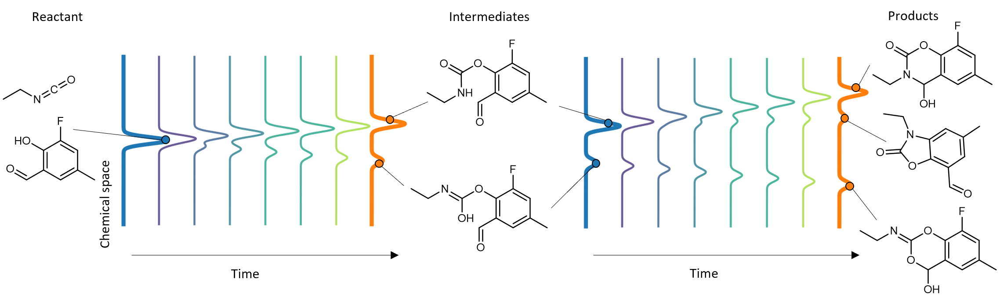

# FlowER: Flow Matching for Electron Redistribution
_Joonyoung F. Joung*, Mun Hong Fong*, Nicholas Casetti, Jordan P. Liles, Ne S. Dassanayake, Connor W. Coley_

**NOW blossomed in _Nature_!**

“Electron flow matching for generative reaction mechanism prediction.” *Nature* **645**, 115–123 (2025).  
DOI: [10.1038/s41586-025-09426-9](https://doi.org/10.1038/s41586-025-09426-9)

---

## 🔔 [Update — May 29 2026]

This release uses **only the new-data checkpoint**, and the file layout described below reflects this new workflow.

**Want the version published in _Nature_?** Make sure you have **already cloned this repository** first, then fetch the tags and check out `2.0.0`:

```bash
git fetch --tags
git checkout tags/2.0.0
```

> **Note:** You must clone the repository first before running the commands above.

---



FlowER uses flow matching to model chemical reaction as a process of electron redistribution, conceptually
aligns with arrow-pushing formalisms. It aims to capture the probabilistic nature of reactions with mass conservation
where multiple outcomes are reached through branching mechanistic networks evolving in time. 

## Environment Setup
### System requirements
**Ubuntu**: >= 16.04 <br>
**conda**: >= 4.0 <br>
**GPU**: at least 25GB Memory with CUDA >= 12.2

```bash
$ conda create -n flower python=3.10
$ conda activate flower
$ pip install -r requirements.txt
```

## Data/Model preparation
FlowER is trained on a combination of subset of USPTO-FULL (Dai et al.), RmechDB and PmechDB (Baldi et al.). <br>
To retrain/reproduce FlowER, download `data.zip` and `checkpoints.zip` from [this link](https://doi.org/10.6084/m9.figshare.32513667), unzip them, and place under `FlowER/`. <br>
The folder structure for the `data` folder is `data/{DATASET_NAME}/{train,val,test}.txt` and `checkpoints` folder is `checkpoints/{DATASET_NAME}/{EXPERIMENT_NAME}/model.{STEP}_{IDX}.pt`

## On how FlowER is structured
The workflow of FlowER revolves mainly around 2 files. `run_FlowER_large_newData.sh` and `settings.py`. <br> 
The main idea is to use comments `#` to turn on/off configurations when training/validating/inferencing FlowER. <br>
`run_FlowER_large_newData.sh` allows user to specify your data folder name, experiment name, gpu configuration and choose which scripts to run. <br>
`settings.py` allows user to specify different configurations for different workflows. 

## Training Pipeline
### 1. Train FlowER
Ensure that `data/` folder is populated accordingly and `run_FlowER_large_newData.sh` is pointing to the correct files.
```
export TRAIN_FILE=$PWD/data/$DATA_NAME/train.txt
export VAL_FILE=$PWD/data/$DATA_NAME/val.txt
```
Check `run_FlowER_large_newData.sh` has `scripts/train.sh` uncommented. 
```bash
$ sh run_FlowER_large_newData.sh
```

### 2. Validate FlowER
You can validate FlowER on the validation set. Then, in `settings.py`, ensure these are uncommented.
```
    # validation #
    do_validate = True
    steps2validate =  ["1050000", "1320000", "1500000", "930000", "1020000"]
```
`steps2validate` refers to the checkpoints that are selected based on train logs situated at the `/logs` folder. <br>
Check `run_FlowER_large_newData.sh` has `scripts/eval.sh` uncommented. 
```bash
$ sh run_FlowER_large_newData.sh
```


### 3. Test FlowER
You can validate FlowER on the test set. Then, in `settings.py`, specify your checkpoint at `MODEL_NAME` and ensure these are uncommented.
```
    # inference #
    do_validate = False
```
Check `run_FlowER_large_newData.sh` has `scripts/eval.sh` uncommented. 
```bash
$ sh run_FlowER_large_newData.sh
```

#### FlowER train/valid/test input
FlowER takes in atom-mapped reaction as input for training, validation and testing. Each of this elementary reaction steps that is trained on FlowER can be grouped together using sequence index during evaluation when running `sequence_evaluation.py`. \
\
An elementary reaction step reaction follows the format of `mapped_reaction|sequence_idx`. Examples are as follows:
```
[Cl:1][S:2]([Cl:3])=[O:4].[Cl:5][C:6]1=[N:7][S:8][C:9]([C:10](=[O:11])[O:12][H:15])=[C:13]1[Cl:14]>>[Cl:1][S:2]([Cl:3])([O-:4])[O:11][C:10]([C:9]1=[C:13]([Cl:14])[C:6]([Cl:5])=[N:7][S:8]1)=[O+:12][H:15]|11831
[Cl:1][S:2]([Cl:3])([O-:4])[O:11][C:10]([C:9]1=[C:13]([Cl:14])[C:6]([Cl:5])=[N:7][S:8]1)=[O+:12][H:15]>>[Cl-:1].[S:2]([Cl:3])(=[O:4])[O:11][C:10]([C:9]1=[C:13]([Cl:14])[C:6]([Cl:5])=[N:7][S:8]1)=[O+:12][H:15]|11831
[Cl-:1].[S:2]([Cl:3])(=[O:4])[O:11][C:10]([C:9]1=[C:13]([Cl:14])[C:6]([Cl:5])=[N:7][S:8]1)=[O+:12][H:15]>>[Cl:1][C:10]([C:9]1=[C:13]([Cl:14])[C:6]([Cl:5])=[N:7][S:8]1)([O:11][S:2]([Cl:3])=[O:4])[O:12][H:15]|11831
[Cl:1][C:10]([C:9]1=[C:13]([Cl:14])[C:6]([Cl:5])=[N:7][S:8]1)([O:11][S:2]([Cl:3])=[O:4])[O:12][H:15]>>[Cl-:3].[Cl:1][C:10]([C:9]1=[C:13]([Cl:14])[C:6]([Cl:5])=[N:7][S:8]1)=[O+:12][H:15].[S:2](=[O:4])=[O:11]|11831
[Cl-:3].[Cl:1][C:10]([C:9]1=[C:13]([Cl:14])[C:6]([Cl:5])=[N:7][S:8]1)=[O+:12][H:15].[S:2](=[O:4])=[O:11]>>[Cl:1][C:10]([C:9]1=[C:13]([Cl:14])[C:6]([Cl:5])=[N:7][S:8]1)=[O:12].[Cl:3][H:15].[S:2](=[O:4])=[O:11]|11831
[Cl:1][C:10]([C:9]1=[C:13]([Cl:14])[C:6]([Cl:5])=[N:7][S:8]1)=[O:12].[Cl:3][H:15].[S:2](=[O:4])=[O:11]>>[Cl:1][C:10]([C:9]1=[C:13]([Cl:14])[C:6]([Cl:5])=[N:7][S:8]1)=[O:12].[Cl:3][H:15].[S:2](=[O:4])=[O:11]|11831
```

<details><summary><b>Train/Valid/Test hyperparameters</b></summary>

### Model Architecture
- **`emb_dim`**  - Embedding dimension size of atom embeddings
- **`enc_num_layers`** - Number of transformer layers to be applied
- **`enc_heads`** - Number of attention heads
- **`enc_filter_size`** - Dimension of Feed-Forward Network in Transformer block
- **`(attn)_dropout`** - Dropout for Transformer block (0.0 empirically works well)
- **`sigma`** - Standard deviation of Gaussian noise added for reparameterizing the bond-electron (BE) matrix

### Optimization
- **`lr`** - Learning rate for training (NoamLR)
- **`warmup`** - Warmup steps before LR decay (NoamLR)
- **`clip_norm`** - Gradient clipping threshold to prevent exploding gradients
- **`beta1`**, **`beta2`**  -  Adam optimizer’s momentum terms
- **`eps`** -  Adam optimizer’s denominator term for numerical stability
- **`weight_decay`** - L2 regularization strength to prevent overfitting

### Input representation (Bond-Electron matrix)
- **`rbf_low`** - Radial Basis Function (RBF) centers lowest value
- **`rbf_high`** - Radial Basis Function (RBF) centers highest value
- **`rbf_gap`** - Glanularity of RBF centers increment

### Inference 
- **`do_validate`** - True to trigger validation, False to trigger testing
- **`steps2validate`** - List of checkpoints to run FlowER on for validation
- **`sample_size`** - Number of samples FlowER generates for evaluation

</details>

### 4. Use FlowER for search
FlowER mainly uses beam search to seek for plausible mechanistic pathways. Users can input their smiles at `data/flower_new_dataset/beam.txt`. <br>
Ensure that in `run_FlowER_large_newData.sh`, the `TEST_FILE` variable is pointing towards the correct file.
```
export TEST_FILE=$PWD/data/$DATA_NAME/beam.txt
```
Ensure that in `settings.py`, beam search configuration are uncommented and specified accordingly.
```
    test_path = f"data/{DATA_NAME}/beam.txt"

    # beam-search #
    beam_size = 5
    nbest = 3
    max_depth = 15
    chunk_size = 50
```
Check `run_FlowER_large_newData.sh` has `scripts/search.sh` uncommented. 
```bash
$ sh run_FlowER_large_newData.sh
```
Visualize your route at `examples/vis_network.ipynb`

#### FlowER search input
FlowER takes in a non atom-mapped reaction for beam search which can be specified in `beam.txt`
The format of reactants in the file follows `reactant>>product1|product2|...`, where we can specify multiple major and minor products separated by `|` in the file
```
CC(=O)CC(=O)C(F)(F)F.NNc1cccc(Br)c1>>Cc1cc(C(F)(F)F)n(-c2cccc(Br)c2)n1
CC(=O)CC(=O)C(F)(F)F.NNc1cccc(Br)c1>>Cc1cc(C(F)(F)F)n(-c2cccc(Br)c2)n1|Cc1cc(C(F)(F)F)nn1-c1cccc(Br)c1
```

<details><summary><b>Search hyperparameters</b></summary>

- **`beam_size`** - Size of top-k selection of candidates (based on cumulative probability)
to be further expanded. Increasing this would make the overall search more comprehensive, but at the
cost of slower runtime.
- **`nbest`** - Cut-off size of the top-k outcomes generated by FlowER after the expan-
sion. This cutoff can filter out unlikely outcomes to be part of the selection.
- **`sample_size`** - Number of samples FlowER generates for evaluation
- **`max_depth`** - Refers to the maximum depth the beam search should explore.
- **`chunk_size`** - Number of reactants sets to be run beam search concurrently.

</details>

## Conservation _(added May 29 2026)_
Conservation experiments on the paper measures predicted output's conservation of mass and electron across all 30 output sample per input from the model. The reproduction scripts live in [`examples/conservation/`](examples/conservation/).

Because FlowER and the SMILES-based baselines produce different outputs, conservation is measured two ways:

- **FlowER** conserves by construction. During inference (`eval_multiGPU.py`) every reaction emits a 5-slot tally `[A, B, C, D, E]` at the start of its line in the prediction file, counting its `N` samples:
  `A` correct (valid SMILES, matches target, conserved) · `B` valid SMILES, wrong product, still conserved · `C` valid SMILES, not conserved · `D` no valid SMILES, conserved · `E` no valid SMILES, not conserved.
  The conservation metric is **`(A + B) / N`** averaged over reactions — the fraction of samples giving a valid molecule that also conserves electrons. Since FlowER conserves heavy atoms, protons and electrons alike, this single number stands in for all of them.
- **Graph2SMILES / Molecular Transformer** only output raw SMILES, so conservation is **recomputed** from each predicted SMILES against the ground-truth product, giving four separate percentages: validity, heavy-atom, proton (H), and electron conservation.

### Reproduce — FlowER
Run inference on the test set to produce the prediction file (`<phase>-<sample_size>-<checkpoint>.txt` under `RESULT_PATH`), using **30 samples** to match the baselines (`SAMPLE_SIZE` is read from the environment):
```bash
export SAMPLE_SIZE=30
sh run_FlowER_large_newData.sh        # with scripts/eval_multiGPU.sh uncommented
python examples/conservation/flower_conservation.py <RESULT_PATH>/<prediction>.txt
```

### Reproduce — Graph2SMILES / Molecular Transformer
Score a baseline prediction file (`nbest = 30` per input; each entry `SMILES_loglikelihood`, comma-separated) against the same ground-truth test set:
```bash
python examples/conservation/g2s_conservation.py \
    --gt data/flower_new_dataset/test.txt \
    --pred <baseline_predictions>.txt \
    --nbest 30
```

## Citation
```bibtex
@article{joung2025electron,
  title={Electron flow matching for generative reaction mechanism prediction obeying conservation laws},
  author={Joung, Joonyoung F and Fong, Mun Hong and Casetti, Nicholas and Liles, Jordan P and Dassanayake, Ne S and Coley, Connor W},
  journal={arXiv preprint arXiv:2502.12979},
  year={2025}
}
```

